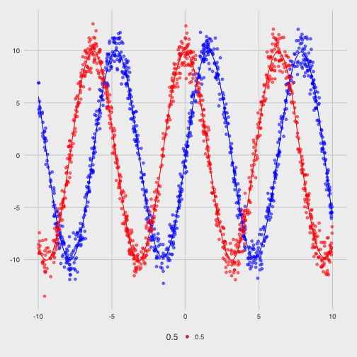

# A Comparison of `ggthemes`

First, we'll look at the data, and its plot in base R graphics


```r
x <- runif(1000, min = -10, max = 10)
y <- 10 * sin(x) + rnorm(1000, 0, 1)
fit.y <- smooth.spline(x, y)
z <- 10 * cos(x) + rnorm(1000, 0, 1)
fit.z <- smooth.spline(x, z)

plot(x, y, col = rgb(0, 0, 1, .5), pch = 16)
points(x, z, col = rgb(1, 0, 0, .5), pch = 16)
lines(fit.y, col = rgb(0, 0, 1))
lines(fit.z, col = rgb(1, 0, 0))
```


Next, we'll do the same thing in a bunch of themes so we can visually see which is best.


```r
hat.y <- predict(fit.y)
hat.z <- predict(fit.z)

base.plot <- ggplot() +
  geom_point(aes(x = x, y = y, alpha = 0.5), color = "blue") +
  geom_line(aes(x = hat.y$x, y = hat.y$y), color = "blue", se = FALSE) + 
  geom_point(aes(x = x, y = z, alpha = 0.5), color = "red") +
  geom_line(aes(x = hat.z$x, y = hat.z$y), color = "red", se = FALSE) +
  guides(fill=FALSE)

base.plot
```


```r
base.plot + theme_calc()
```


```r
base.plot + theme_economist() + scale_colour_economist()
```


```r
base.plot + theme_excel() + scale_colour_excel()
```


```r
base.plot + theme_few() + scale_colour_few()
```


```r
base.plot + theme_fivethirtyeight()
```



```r
base.plot + theme_gdocs() + scale_colour_gdocs()
```


```r
base.plot + theme_hc() + scale_colour_hc()
```


```r
base.plot + theme_hc(bgcolor = "darkunica") + scale_colour_hc("darkunica")
```


```r
base.plot + theme_par()
```


```r
base.plot + theme_pander() + scale_colour_pander()
```


```r
base.plot + theme_solarized() + scale_colour_solarized()
```


```r
base.plot + theme_stata()
```


```r
base.plot + theme_tufte()
```


```r
base.plot + theme_wsj()
```


